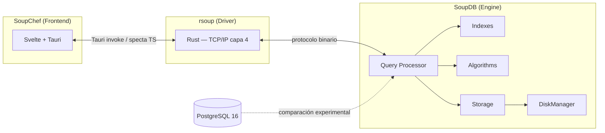

# SoupDB

[](https://github.com/BD2-Project/SoupBD/actions/workflows/ci.yml)
[](https://github.com/BD2-Project/SoupBD/actions/workflows/ci.yml)
[]()
[](LICENSE)
[]()

Motor de base de datos **multimodal** (relacional, espacial, vectorial) con integración de IA, construido desde cero en Python. La aplicación final es un **RAG sobre papers académicos**. Proyecto académico — UTEC, Base de Datos 2, ciclo 2026-2.

## Arquitectura



Trabajo **multirepo**: `SoupDB` (motor, este repo), `rsoup` (driver de red y transacciones) y `SoupChef` (frontend). El contexto compartido de arquitectura, reglas y convenciones vive en el repositorio privado `.agents` (punto de entrada: `AGENTS.md`).

## Setup

```bash
# Desarrollo local (nix) — entorno solo para nuestro equipo
nix-shell

# o con uv directo
uv sync

# Tests y lint
uv run pytest
uv run ruff check .
```

## Gestión de paquete y contenedor

- **Paquete:** el motor se gestiona con **uv** (`pyproject.toml` + `uv.lock` versionado). El wheel se construye con `uv build` y se adjunta a cada release. El runtime no tiene dependencias externas (solo stdlib).
- **Contenedor:** `Dockerfile` multi-stage (build con uv sobre imagen slim) + `docker-compose.yml` con los servicios `engine`, `postgres:16` y `web` (placeholder `SoupChef`). La imagen del engine se publica en **GHCR** (`ghcr.io/BD2-Project/soupdb`) al crear un tag de versión.

## Documentación

- API reference y guías: https://BD2-Project.github.io/SoupBD
- Informe técnico (typst): se publica como **PDF** en las [Releases](https://github.com/BD2-Project/SoupBD/releases).
- Estrategia de versionado de releases: `docs/estrategia-release.md`.

## Licencia

MIT — ver [LICENSE](LICENSE).